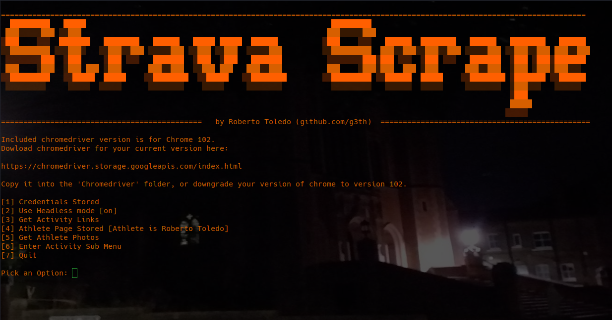

# Strava Scrape
## A Scraper for Strava



Scrapes data from the popular physical excercise (often a forbidden word pairing among coding enthusiasts) platform using Selenium and Beautiful Soup. Does not use their api. Why? Because I can take what I want without your permission or an api-key kid, as Google has been doing for years without consequence.

Currently using Chromedriver for Chrome Version 102. Downgrade if necessary.

Include a user Interface. A Strava account is required; although premium isn't necessary, the user you wish to scrape must have a public profile.

User will need to:

1) Login and create a persistent cookie
2) Enter their own athlete page

Once ```cookie.json``` exists in ```data``` folder, it will login automatically upon each session. If you wish to reset the cookie, just delete 'cookies.json' in the main program folder.

Work in progress, currently fetches all activity links for different years.
